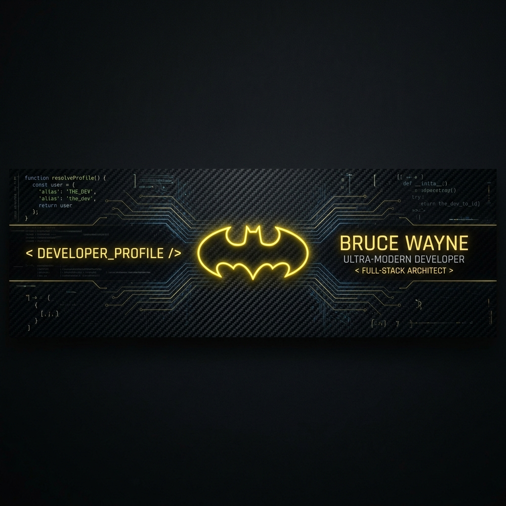

<!-- Custom Batman-Themed Premium Developer Banner -->
<p align="center">
  
</p>

<h1 align="center">🦇 I'm Batman (by night) and a Full-Stack Engineer (by day) ⚡</h1>
<p align="center">
  <strong>"I am the night. I am the code. I am... Biyyani Hari Venkata Gopal."</strong>
</p>

<p align="center">
  <a href="https://instagram.com"></a>
  <a href="https://linkedin.com"></a>
  <a href="https://pinterest.com"></a>
  <a href="mailto:biyyanihari7@gmail.com"></a>
</p>

---

### 🕵️ About Me

```text
  im batman.
```

I am an undergraduate Computer Science student at **MLR Institute of Technology** who designs and develops high-performance full-stack applications. Like the Dark Knight, I operate with precision—architecting scalable systems using **Java, Python, React, and Spring Boot**, while integrating **Generative AI** tools, prompt engineering, and deep machine learning models.

- ⚔️ **My Mission**: Building AI-powered web ecosystems that solve real-world problems.
- 🎓 **Undergrad**: B.Tech in Computer Science & Engineering at MLRIT (GPA: 7.5 / 10.0)
- 💼 **Agile Combat**: Completed a Software Engineering Internship at Infosys Springboard
- 🎯 **Primary Targets**: Deep learning models, full-stack optimizations, and responsive mobile architectures

---

### 💻 Tech Stack & Arsenal

<table width="100%">
  <tr>
    <td width="50%" valign="top">
      <h4>🗡️ Core Programming Languages</h4>
      
      <br>
      
      <br>
      
      <br>
      
      <br>
      
      
    </td>
    <td width="50%" valign="top">
      <h4>🎨 Frontend, Mobile & Styles</h4>
      
      <br>
      
      <br>
      
      <br>
      
      
    </td>
  </tr>
  <tr>
    <td width="50%" valign="top">
      <h4>⚙️ Backend & API Frameworks</h4>
      
      <br>
      
      <br>
      
      
    </td>
    <td width="50%" valign="top">
      <h4>🪐 Databases & Cloud Infrastructure</h4>
      
      <br>
      
      <br>
      
      
    </td>
  </tr>
  <tr>
    <td width="50%" valign="top">
      <h4>🤖 AI, Deep Learning & Engines</h4>
      
      <br>
      
      
    </td>
    <td width="50%" valign="top">
      <h4>🛠️ DevOps & Industry Tools</h4>
      
      <br>
      
      
    </td>
  </tr>
  <tr>
    <td width="100%" colspan="2">
      <h4>🎨 Design, 3D Drafting & Gaming</h4>
      
      
      
      
      <br>
      
      
      
      
    </td>
  </tr>
</table>

---

### 📊 Batcave Intel & Analytics

<p align="center">
  
  
</p>

<p align="center">
  
</p>

<p align="center">
  
</p>

---

### ✍️ Random Dev Quote

<p align="center">
  
</p>

---

<p align="center">
  💡 <em>"It's not who I am underneath, but what I code that defines me."</em>
</p>
