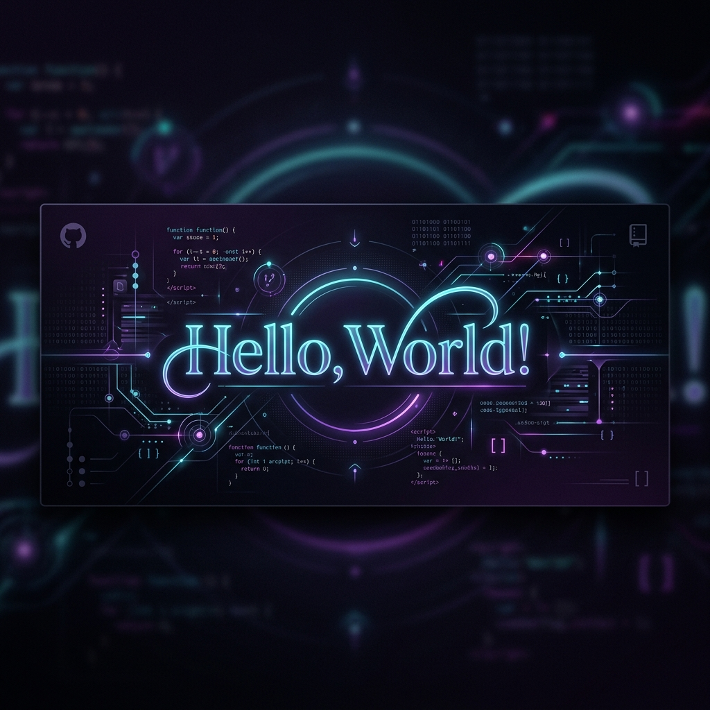

<!-- Custom Premium GitHub Profile README Banner -->

  

<h1 align="center">Hey there! I'm Biyyani Hari Venkata Gopal 👋</h1>

  <strong>Computer Science Student | Full-Stack & Generative AI Developer</strong>

  
  
  

---

### 💫 About Me

I am an undergraduate Computer Science student at **MLR Institute of Technology** with hands-on experience building AI-powered full-stack applications. I specialize in designing scalable systems using **Java, Python, React, and Spring Boot**, combined with advanced **Generative AI** integrations and prompt engineering workflows.

- 🎓 **Education**: Pursuing B.Tech in Computer Science & Engineering at MLR Institute of Technology (2023 - Present)
- 💼 **Experience**: Completed a Software Engineering Internship at Infosys Springboard
- 🚀 **Passionate about**: AI-driven products, full-stack architectures, and solving real-world engineering challenges
- 📫 **How to reach me**: [biyyanihari7@gmail.com](mailto:biyyanihari7@gmail.com)

---

### 💼 Work Experience

#### **Infosys Springboard** | *Software Engineering Intern* (Feb 2026 - Apr 2026)
- Developed and tested RESTful APIs using **Java** and **Spring Boot**, implementing clean coding standards and Git workflows.
- Built a full-stack **Library Management System** integrating Spring Boot, React.js, MySQL, and JWT role-based authentication.
- Designed secure backend modules for book issue/return management under agile development timelines.

---

### 🚀 Highlighted Projects

#### **ShareFare – Verified Campus Mobility Platform** | *React, TypeScript, Spring Boot, Leaflet, Tailwind CSS*
- Built a campus ride-sharing web app featuring live Leaflet map integrations, OSRM routing, and dynamic ETA calculations.
- Designed secure backend ride booking lifecycles with prompt-engineered AI ride assistance for intelligent travel suggestions.
- Integrated admin moderation panels and college ID verification for secure student-only transport pools.

#### **Smart Crop Advisory and Disease Detection System (AgroSmart)** | *Flask, CNN/Keras, RandomForest, SQLite*
- Built and deployed a machine learning web app for crop disease detection and crop classification on real-world agricultural datasets.
- Developed farmer profile dashboards with SQLite/SQLAlchemy backend, persistent history tracking, and fertilizer recommenders.

---

### 🛠️ Tech Stack & Skills

<table width="100%">
  <tr>
    <td width="50%" valign="top">
      <h4>💻 Languages & Core</h4>
      
       
      
       
      
    </td>
    <td width="50%" valign="top">
      <h4>🎨 Frontend & Web Frameworks</h4>
      
       
      
      
    </td>
  </tr>
  <tr>
    <td width="50%" valign="top">
      <h4>🤖 AI, ML & Generative AI</h4>
      
       
      
      
    </td>
    <td width="50%" valign="top">
      <h4>🔧 Tools & DevOps</h4>
      
       
      
      
    </td>
  </tr>
</table>

---

### 🏆 Certifications

- 🎖️ **AI Fundamentals: Foundations for Understanding AI** — *IBM SkillsBuild*
- 🎖️ **Java Full Stack Developer Certification** — *Infosys Springboard*
- 🎖️ **Software Engineering Intern Certification** — *Infosys*

---

### 📊 GitHub Activity & Analytics

  
  

  

---

  💡 <em>"Code is like humor. When you have to explain it, it’s bad."</em>

